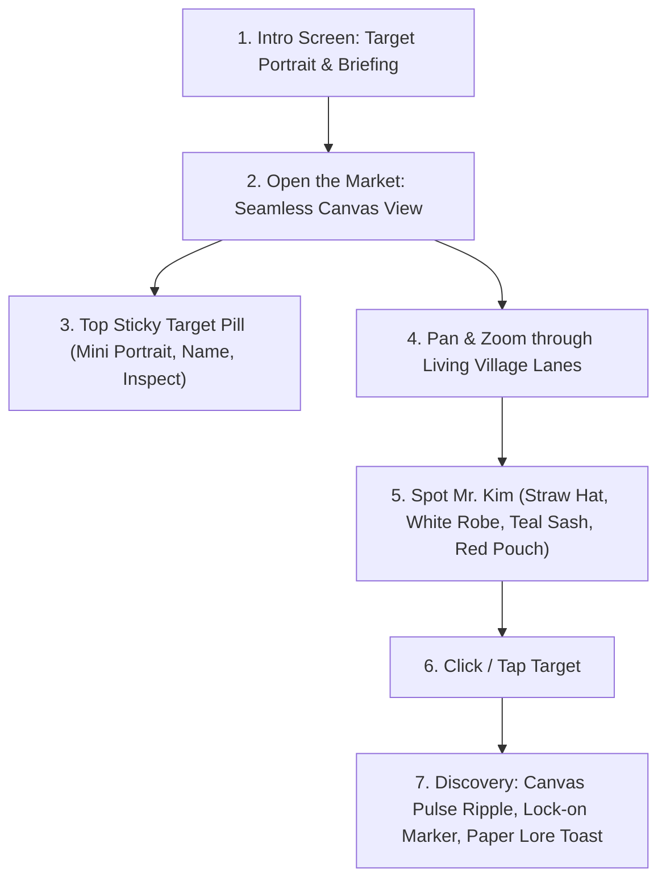

# Deep Dive: Decoding `whereismrkim.com`
### Art Direction, Technical Architecture, and Experience Design of a Modern Digital Wimmelbild

---

## 1. Executive Summary

[whereismrkim.com](https://whereismrkim.com/) is a masterclass in modern digital Wimmelbild (hidden-object illustration). Instead of feeling like a video game, a SimCity prototype, or a commercial app, it presents itself as a **poetic, living historical scroll** depicting a bustling Joseon-era Korean market village. 

The site achieves widespread acclaim by balancing four pillars:
1. **Artistic Materiality**: A tactile "hanji paper and mineral ink" visual design.
2. **Understated Interaction**: Zero gamification clutter; quiet, dignified discovery.
3. **High-Performance WebGL Engine**: Massive multi-tile world streaming with sub-pixel depth sorting and visibility probes.
4. **Narrative Micro-Vignettes**: Hundreds of characters engaged in lived-in village micro-scenes, making exploration the true reward.

---

## 2. Visual Style & Aesthetic Philosophy ("The Vibe")

### A. The "Paper & Mineral Ink" Materiality
The entire visual world feels like an authentic traditional Korean folk painting (*Minhwa*) that has come to life:
- **Background & Canvas**: Warm handmade mulberry paper (*Hanji*) tone (`#eee8d9`, `#f7f1e5`).
- **Linework**: Expressive, organic brush/soot outlines (`#27372f` ink). It completely avoids sterile CAD vectors, harsh black outlines, or rigid geometric grid boxes.
- **Pigment Palette**:
  - Primary Ground / Architecture: Natural timber, weathered thatch, ochre clay (`#b99b64`, `#d8cda8`).
  - Garments & Textiles: Mineral indigo, persimmon terracotta (`#974631`), sage green (`#2d433d`), and undyed linen white.
  - Accent / Borders: Warm earthen lines (`#cdbfa4`, `#8e775d66`).
- **Tactile Surfaces (`.paper`)**:
  - UI containers have soft 1px borders (`#8e775d66`), rounded 4–8px corners, subtle inner glows, and gentle ambient shadows (`0 3px 16px #352c1912`).

### B. Typography & Literary Restraint
- **Typeface**: Embedded traditional Korean serif (*Gowun Batang*, *AppleMyungjo*, *Nanum Myeongjo*).
- **Hierarchy**:
  - Small-caps eyebrows (`.smallcap`): `0.75rem`, letter-spacing `0.08em`, uppercase, muted earth tone (`#535b50`).
  - Unhurried, poetic headings: `Find Mr. Kim.`, `A crowded market`.
  - Minimalist prose: *"Somewhere in this village is a man in a straw hat, white robe, teal sash and red pouch."*

### C. Restraint Over Gimmicks
- **No Arcade Noise**: No neon health bars, flashing "COMBO ×3" signs, XP meters, or loud sounds.
- **Physicality**: Drag cursor changes from `grab` to `grabbing`, movement has smooth inertial momentum, and zoom scales smoothly around the mouse pointer.

---

## 3. The Gameplay & Interaction Loop

### Step 1: The Heritage Prologue (`#start-screen`)
- An elegant floating paper modal:
  - **Left**: Inset target portrait on warm illuminated paper with a delicate drop shadow.
  - **Right**: Title (`Find Mr. Kim.`), four distinct costume identifiers (straw hat, white robe, teal sash, red pouch), and a button: *"Opening the market..."* → *"Enter the market"*.

### Step 2: The Top Target HUD (`#target-card.paper`)
- A minimal, sticky paper pill anchored at the top-center of the viewport:
  - Mini portrait thumbnail (`width: 32px, height: 55px`).
  - Target name: `Mr.Kim`.
  - Optional subtle countdown timer (`05:00`).
  - Info button (`i`) for credits and Easter egg hints.
- **Click-to-Inspect**: Clicking the target preview opens a large portrait lightbox dialog, allowing players to study fine clothing details before panning through the crowds.

### Step 3: Living Micro-Vignettes
- The market features 420–450 characters:
  - Potters throwing earthenware jars.
  - Fishmongers drying pollack on wooden racks.
  - A stray dog barking at wandering chickens.
  - Gossiping village elders beside the stone well.
  - Scholars reading calligraphy scrolls in shaded verandas.
  - Roof cats sunbathing on clay tiles.

### Step 4: The Discovery Moment
- Clicking Mr. Kim triggers:
  1. **Visual Pulse (`#pulse`)**: An expanding concentric ripple centered on his exact coordinates.
  2. **Target Marker (`#target-marker`)**: A subtle framing bracket locking onto him.
  3. **Paper Toast (`#toast`)**: A warm sliding paper notification with a small-caps category eyebrow and poetic story text.
  4. **Harmonic Chime**: A gentle, organic audio confirmation.

---

## 4. Technical & Engineering Architecture

Inspecting `app.js`, `people.js`, and `styles.css` reveals sophisticated engineering underneath the tranquil surface:

### A. Rendering Pipeline
- **Canvas / WebGL 2 Engine**: Renders a massive spatial world (`START_CAMERA = { x: 3100, y: 1950, zoom: 0.65 }`, zoom limits `0.04×` to `2.2×`).
- **GPU Tile Memory Budget**: Fixed resident texture budget (`GPU_TILE_BUDGET = 224 * MEBIBYTE`), preventing blank tile pop-ins during rapid panning.
- **Sub-Pixel Depth Buffer**:
  - Encoding: `rg-uint16-normalized-depth+b-owner-id`.
  - Enables characters to walk realistically behind building eaves, tree branches, and archways with accurate occlusions.

### B. Spatial Instancing & Visibility Rescue
- **Deterministic Roster**: 450 characters placed using fixed pseudorandom spatial seeds (`LIFE_VARIANT_SEEDS = [481920, 12345, 20260917, 931]`).
- **Visibility Rescue Probes**:
  - The engine continuously runs probe checks on the target's bounding box to guarantee Mr. Kim is never more than 10% occluded by building roofs or foreground geometry (`MAX_HIDDEN_IDENTITY_FRACTION = 0.10`).

### C. Input & Performance
- **Coarse Pointer Optimization**: Detects mobile devices (`pointer: coarse`) and lowers backing pixel budget to `750,000` px (vs. `4,000,000` on desktop) for fluid 60 FPS performance.
- **Smooth Gesture Handling**: Dual-finger pinch-to-zoom, inertial touch dragging, and keyboard navigation (`Arrow keys` with `KEYBOARD_CAMERA_SPEED = 620`).

---

## 5. Blueprint: Translating `whereismrkim.com` to Mapping HYD

| `whereismrkim.com` Feature | Mapping HYD Implementation |
| :--- | :--- |
| **Joseon Market Village** | **Old Hyderabad / Charminar Precinct**: Sandstone streetscapes, Pathargatti granite arcades, Laad Bazaar bangle shops, and Nimrah Cafe terrace. |
| **Search for Mr. Kim** | **Search for 6 Iconic Cultural Figures & Relics**: The Lac Bangle Artisan, Nimrah Chai Master, Mitti Attar Distiller, Basra Pearl Dealer, Osmania Baker, and Bidri Craftsman. |
| **Hanji Paper (`#eee8d9`)** | **Deccan Parchment (`#FAF5EE`)**: Aged warm paper tones, carbon ink typography, terracotta red (`#A85D38`), and warm brass gold (`#D97706`). |
| **Top Target Card Pill** | **Sticky Heritage Target Pill**: Miniature illustrated icon of the active relic/artisan, category eyebrow (`BAZAAR CRAFT`), and discovery count (`0 of 6 Found`). |
| **Portrait Lightbox** | **Artifact & Lore Sheet Modal**: Displays cultural provenance, historical period, and location hints. |
| **Discovery Pulse (`#pulse`)** | **Golden Canvas Ripple**: Concentric expanding ring drawn at the target coordinates upon discovery. |
| **Discovery Toast (`#toast`)** | **Sliding Paper Heritage Toast**: Displays the discovery title, permanent golden seal stamp (`✓`), and two sentences of rich cultural history. |
| **Audio Feedback** | **Synthesized Web Audio Chime**: Gentle, clean 4-tone harmonic chime on discovery. |

---

## 6. Summary

The core lesson of `whereismrkim.com` is that **restraint and texture create immersion**. By treating the digital canvas as a living historical document rather than an arcade game, the user is invited to slow down, look closely, and appreciate the craftsmanship of the illustrated world.
